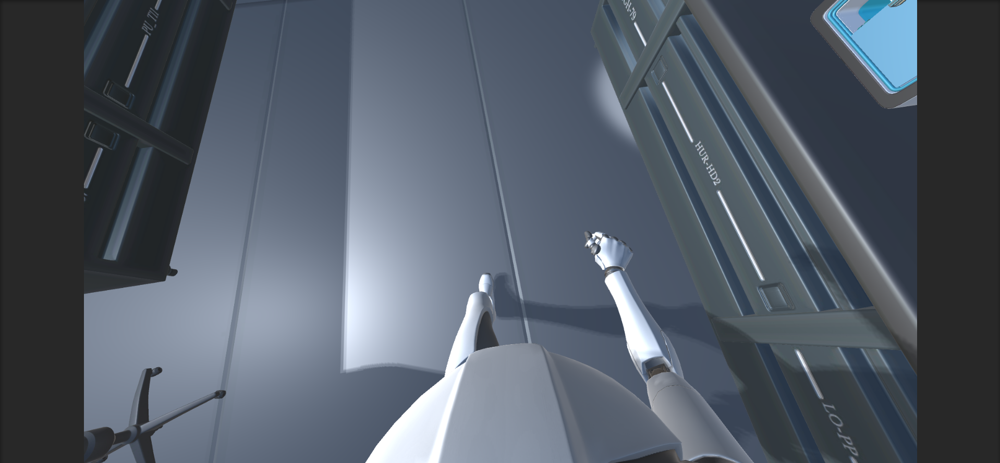
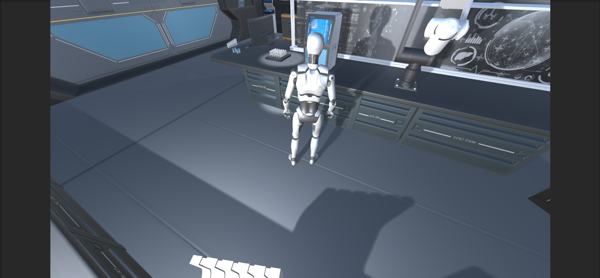
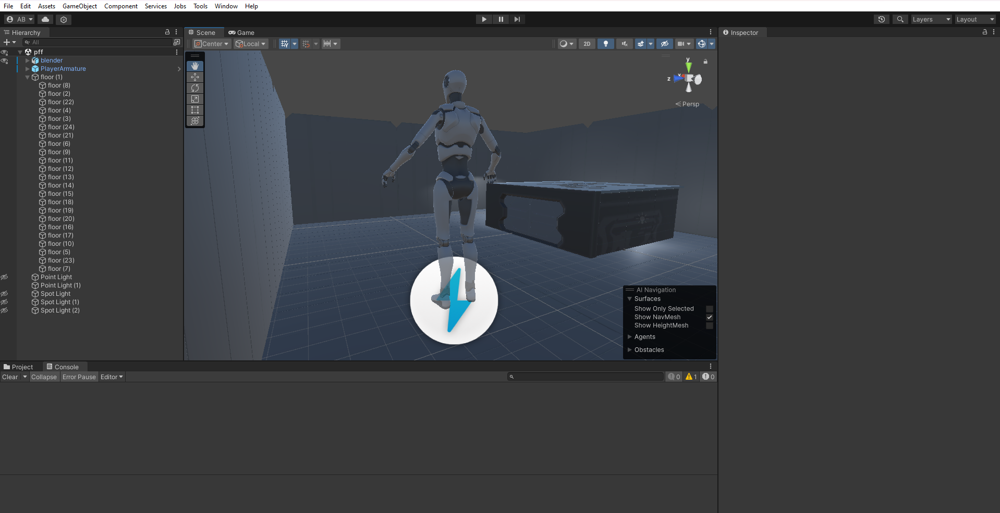

# Unity Laboratory Simulation

This repository showcases a Unity-based laboratory simulation, offering a 3D/first-person perspective with a character navigating the environment. The contents include screenshots, video recordings, and C# scripts. Please note that the full project is private.

## Images

1.   

2.   

3.   

